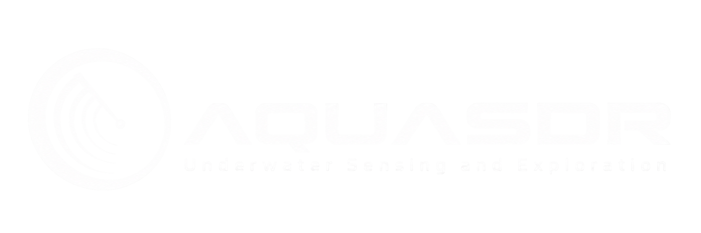
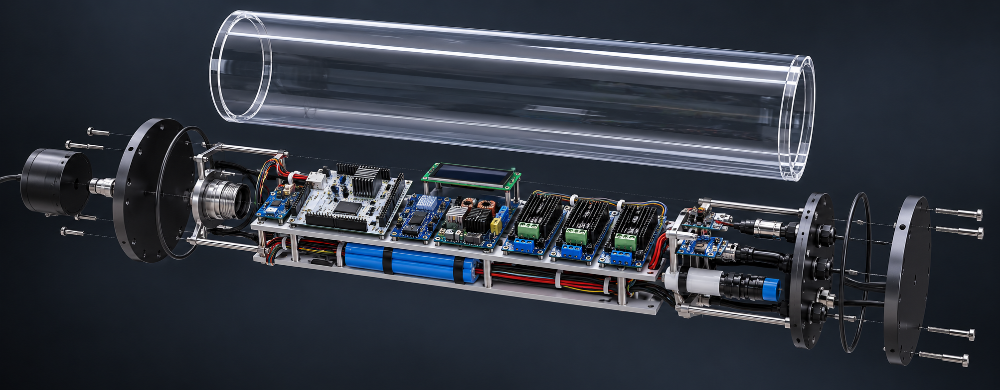
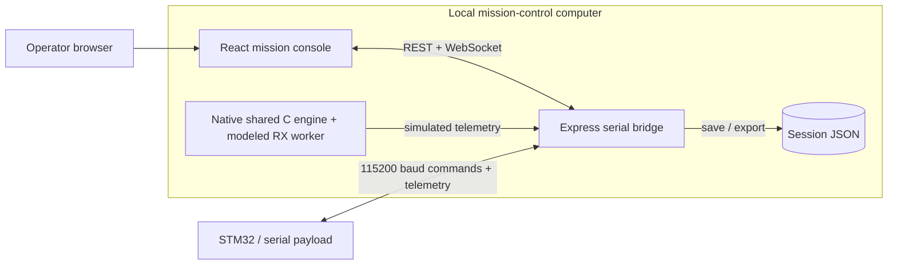

<div align="center">
  

  <h1></h1>

  <p>
    A local-first engineering console for monitoring, simulating, and validating<br />
    an adaptive software-defined sonar payload.
  </p>

  <p>
    
    
    
    
    
  </p>

  <p>
    <a href="#quick-start">Quick start</a> ·
    <a href="#system-architecture">Architecture</a> ·
    <a href="#hardware-integration">Hardware integration</a> ·
    <a href="./docs/HOSTINGER_DEPLOYMENT.md">Hostinger VPS plan</a> ·
    <a href="./arduino/README.md">Complete wiring</a> ·
    <a href="#api-reference">API</a> ·
    <a href="#testing">Testing</a>
  </p>
</div>

> [!IMPORTANT]
> AquaSDR is an engineering prototype, not a certified navigation, life-safety, or production sonar system. Compatible adaptive firmware accepts environment, source, modulation and Start/Stop commands that control DAC PA4. Legacy firmware remains read-only. Physical analog/acoustic commissioning is still pending.

## Overview

### PS 26058: adaptive firmware candidate

The [environment-controlled firmware](firmware/ADAPTIVE_BENCH.md) runs one C policy
for web commands and the physical A0 dial, with guarded DMA/DAC pulse updates.
The offline console compiles and runs that same C engine on the local host.
Use Adaptation → Use web control → Apply environment → Start output.
The new image is software-tested and cross-compiled, **not physically validated**.
The Arduino sensor/TFT program remains separate. Physical conditioning/amplification,
scope validation, power measurements and enclosure construction remain required.

AquaSDR Mission Control brings the payload state, acoustic return, waveform configuration, environmental conditions, adaptation decisions, power model, and hardware health into one operator-focused interface. It can run entirely in deterministic demo mode or receive validated JSON-lines telemetry from an STM32-class payload over a local serial connection.

The console is intentionally local. The bridge binds to `127.0.0.1`, stores sessions on the host machine, and is designed to stay beside the USB-connected payload rather than operate as a public cloud service.

<p align="center">
  
</p>

<p align="center"><sub><strong>Payload concept visualization.</strong> Illustrative only—not a manufacturing drawing, wiring reference, or validated representation of the assembled hardware.</sub></p>

### What it provides

- Nine focused workspaces for mission, sonar, adaptation, validation, sensors, power, mapping, hardware, and event logs.
- A deterministic 0–3 m test-tank simulation with labelled synthetic returns.
- LFM chirp, geometric sweep, and Barker-13 phase-coded waveform generation.
- Time-domain, FFT, spectrogram, A-scan, and scrolling echogram visualizations.
- A visible condition → policy → output adaptation chain with hysteresis.
- Serial telemetry validation, sequence tracking, stale-data masking, reconnect handling, and WebSocket streaming.
- Explicit data provenance: every value is marked as `DEMO`, `SIMULATED`, `LIVE`, `TARGET`, `MEASURED`, `ESTIMATE`, `COMPUTED`, or `UNAVAILABLE`.
- Local session recording, JSON save/export, deterministic replay inputs, keyboard navigation, and reduced-motion support.

## Quick start

### Requirements

- Node.js 22 or newer
- npm
- Host C compiler (`cc`, or set `CC` to its executable path) for the shared firmware simulation/reference engine
- A modern browser
- Optional for hardware mode: a serial device that implements [telemetry protocol version 1](#telemetry-protocol-version-1)

### Development

```sh
npm install
npm run dev
```

Open [http://127.0.0.1:5173](http://127.0.0.1:5173). The Vite frontend runs on port `5173`; the serial and telemetry bridge runs on `127.0.0.1:4318`.

### Production

```sh
npm ci
npm run build
npm start
```

Open [http://127.0.0.1:4318](http://127.0.0.1:4318). The Express bridge serves the compiled interface from `dist/`.

### Verify the installation

```sh
npm test
npm run build
```

The test suite covers waveform generation, FFT calibration, simulator determinism, power calculations, CSV survey parsing, protocol validation, and serial parser recovery.

## System architecture



The frontend never talks directly to a serial device. The bridge owns device discovery, packet validation, freshness checks, session state, and fan-out to browser clients.

### Runtime flow

1. The operator selects `DEMO` or `Hardware — STM32` from the data-source control.
2. Demo mode produces deterministic telemetry; hardware mode waits for a selected serial port.
3. The bridge validates and normalizes the active source into a common state frame.
4. REST endpoints expose snapshots while `/ws/telemetry` streams live frames.
5. The React interface renders only values whose source and freshness are known.

## Workspaces

| Key | Workspace | Purpose |
| ---: | --- | --- |
| `1` | Mission | Combined echogram, payload, environment, adaptation, power, waveform, timeline, and health view. |
| `2` | Sonar | Expanded echo history and time/FFT/spectrogram waveform inspection. |
| `3` | Adaptation | Environmental condition, policy decision, output change, and explanation chain. |
| `4` | Validation | Side-by-side target, measured, and error values without substituting estimates for measurements. |
| `5` | Sensors | Environmental values and recent trends for temperature, turbidity, pressure, depth, and conductivity. |
| `6` | Power | 3S2P Li-ion pack state, load, estimated endurance, and battery visualization. |
| `7` | Mapping | Deterministic demo terrain or locally imported survey CSV data. |
| `8` | Hardware | Payload model, signal chain, parts inventory, serial-port selection, and connection health. |
| `9` | Logs | Filterable session events, warnings, source changes, and adaptation decisions. |

Number-key navigation is disabled while typing in a form or while a dialog is open. `Esc` closes the active dialog.

## Demo walkthrough

The default simulation runs the same C policy and waveform generator as the STM32.

1. Open **Adaptation** and choose **Use web control**.
2. Choose **Clear shallow reef**, then **Apply environment**.
3. Wait for qualification and press **Start output**. The simulation applies 42 kHz / 4 kHz / 2 ms / 35%.
4. Choose **Muddy estuary** and Apply. The C policy transitions to 38 kHz / 1 kHz / 8 ms / 62%.
5. Compare requested/applied settings, before/after reference waveforms, FFT and spectrogram.
6. Select geometric or Barker-13 modulation and a window; Apply modulation/window.
7. Inspect **Modeled RX**. These illustrative returns are separate from measured telemetry.
8. Press **Stop output**. The bottom session controls manage session activity, not DAC output.

Hardware mode uses the same workflow after compatible firmware advertises its capabilities.
Changing input source stops output. A0 remains available for the physical dial demonstration;
the host simulation has no physical ADC. Real sensor input is reserved for later.

The policy uses max(turbidity index, depth), filtering and hysteresis. Temperature affects
the preview only. Inputs are simulated environmental values, not calibrated readings.
See the [complete protocol, runtime behavior and bench checklist](firmware/ADAPTIVE_BENCH.md).

## Data integrity and provenance

AquaSDR deliberately separates commanded, calculated, simulated, and measured values.

| Label | Meaning |
| --- | --- |
| `DEMO` / `SIMULATED` | Generated by the deterministic local model. |
| `LIVE` | Received from a currently connected and fresh hardware stream. |
| `TARGET` | Commanded or configured value; not proof of physical output. |
| `MEASURED` | Reported by an external measurement source. |
| `ESTIMATE` | Derived using an explicitly stated engineering approximation. |
| `COMPUTED` | Calculated from available inputs. |
| `UNAVAILABLE` | Missing, stale, disconnected, or not implemented. |

The interface does not replace absent measurements with plausible-looking numbers. Hardware telemetry is masked after three seconds without a valid packet, and the bridge itself is considered stale by the frontend after five seconds.

## Hardware integration

The current sensor/TFT bench build is [`arduino/04_all_sensors`](arduino/04_all_sensors/04_all_sensors.ino). It includes sensor telemetry, the ST7735 display, HC-SR04 air-distance readings and a continuous DAC electrical-loopback test. The separate bare-metal milestone in [`firmware/`](firmware/README.md) drives TIM6 → DMA → DAC1 on PA4 through a button-stepped transmit-engine test. Flashing one replaces the other; their D7/D13 uses differ.

### Complete wiring reference

**[Open the full wire-by-wire guide, circuit diagrams and module pin tables](arduino/README.md).** It covers every supply, ground and signal connection, including unused pins and the retired modules. It also records which connections are demonstrated, require correction, or remain planned.

| Subsystem | Wiring reference |
| --- | --- |
| Nucleo and USB / cable distribution | [Pin allocation](arduino/README.md#complete-nucleo-pin-allocation), [whole bench circuit](arduino/README.md#bench-power-and-whole-circuit) |
| ST7735 TFT, replacing 1602 LCD | [Power, SPI, reset and backlight](arduino/README.md#st7735-tft) |
| DS18B20 and TDS | [Temperature adapter](arduino/README.md#ds18b20-and-adapter), [TDS probe and board](arduino/README.md#tds-meter) |
| Pressure and turbidity | [Pressure divider](arduino/README.md#water-pressure), [turbidity divider](arduino/README.md#turbidity) |
| INA219 ×2, BMP390, ISM330DHCX, MMC5983MA | [Shared I²C wiring and module sections](arduino/README.md#shared-i2c-bus) |
| HC-SR04 and A2–A5 test | [Air-distance module](arduino/README.md#hc-sr04), [electrical loopback](arduino/README.md#dac-loopback) |
| Battery, fuse, switch and MP1584 | [Planned power wiring and Nucleo power selection](arduino/README.md#planned-battery-power) |
| TLV9062 ×4, driver, TX/RX piezos | [IC pinouts and planned acoustic chain](arduino/README.md#planned-acoustic-chain) |
| LCD, AD9850, HDMI screen, BTS7960 and 9 V battery | [Retired/excluded connections](arduino/README.md#retired-and-excluded-modules) |

The pressure/turbidity dividers are still required, and the current sketch's divider flags must be changed after they are fitted. The TX/RX analog board and driver do not yet have a completed component-level schematic; pending values and connections are explicitly marked. The 3D model is illustrative, generated from [`scripts/build-payload-model.mjs`](scripts/build-payload-model.mjs).

### Connection workflow

1. Open **Hardware**.
2. Change the data source to **Hardware — STM32**.
3. Select **Refresh ports**.
4. Choose the serial device and connect.
5. Send one complete UTF-8 JSON object per line at `115200` baud.

The bridge retries a selected device after an unexpected disconnect. An explicit disconnect cancels reconnection.

### Telemetry protocol version 1

Each packet must end with `\n` and conform to the following envelope:

```json
{
  "version": 1,
  "type": "telemetry",
  "source": "hardware",
  "seq": 1,
  "timestamp": "2026-09-27T12:00:00.000Z",
  "payload": {
    "sensors": {
      "temperature": 26.4,
      "turbidity": 12.4,
      "pressure": 1.28,
      "depth": 2.76,
      "conductivity": null
    },
    "power": {
      "voltage": 11.9,
      "current": 0.12,
      "watts": 1.428,
      "energy": null,
      "soc": 0.82,
      "charging": false
    },
    "waveform": {
      "mode": "LFM CHIRP",
      "frequency": 40,
      "bandwidth": 2,
      "pulse": 2,
      "amplitude": 62,
      "window": "HANN"
    },
    "engine": {
      "timerHz": 1000000,
      "dmaBuffer": 2000,
      "cpuLoad": 3.4,
      "underruns": 0
    },
    "health": {
      "STM32": "ONLINE",
      "ADC": "READY",
      "DAC": "ACTIVE"
    },
    "firmware": "your-firmware-version"
  }
}
```

Example values document the wire format only. They are never injected into hardware mode.

### Required values and units

Required sensor and power fields must use `null` when unavailable.

| Field | Unit | Constraint |
| --- | --- | --- |
| `temperature` | °C | Finite number or `null` |
| `turbidity` | NTU | Finite number or `null` |
| `pressure` | bar | Finite number or `null` |
| `depth` | m | Finite number or `null` |
| `conductivity` | mS/cm | Finite number or `null` |
| `voltage` | V | Finite number or `null` |
| `current` | A | Finite number or `null`; negative may indicate charging |
| `watts` | W | Finite number or `null` |
| `energy` | Wh | Finite number or `null` |
| `soc` | ratio | Optional number from `0` to `1`, or `null` |

### Optional payload fields

| Field | Contract |
| --- | --- |
| `echo` | `2–2048` normalized intensity bins in `[0, 1]`. Requires `rangeMax`. |
| `rangeMax` | Positive maximum measured range in metres. |
| `samples` | `32–32768` normalized ADC samples in `[-1, 1]`. Requires `sampleRate`. |
| `sampleRate` | Positive samples per second, up to `10 MHz`. |
| `waveform` | Actual reported waveform configuration using the editor units. `window` is `HANN`, `HAMMING` or `BLACKMAN` (defaults to `HANN`). |
| `engine` | Waveform engine runtime: `timerHz` (DAC sample clock), `dmaBuffer` (samples per pulse), `cpuLoad` (`0–100` %, CPU time spent on generation) and `underruns`. All nullable; the console shows NOT REPORTED rather than estimating. |
| `health` | String status map such as `ONLINE`, `READY`, `ERROR`, or `OFFLINE`. |
| `firmware` | Firmware identifier, up to 80 characters. |
| `validation` | Nullable instrument measurements for frequency, bandwidth, pulse, amplitude, noise floor, sidelobe, and THD. |

### Parser and freshness rules

- `seq` must increase within a connection. Duplicate and out-of-order frames are rejected; gaps are counted.
- Device timestamps are retained, while freshness is based on bridge receipt time.
- Invalid JSON, schema violations, and non-finite values are rejected.
- A serial line is limited to `1 MiB`; parsing resumes at the next newline after an oversized frame.
- WebSocket heartbeats run every 15 seconds. The frontend retries after 1.5 seconds.
- Reconnecting starts a new sequence-tracking window.

## API reference

The bridge listens on `http://127.0.0.1:4318`.

### Read endpoints

| Method | Endpoint | Response |
| --- | --- | --- |
| `GET` | `/api/system` | Complete normalized state frame. |
| `GET` | `/api/sensors` | Current sensor values or `null`. |
| `GET` | `/api/waveform` | Active waveform configuration. |
| `GET` | `/api/power` | Current power values or `null`. |
| `GET` | `/api/hardware` | Device, freshness, and connection state. |
| `GET` | `/api/events` | Retained session events. |
| `GET` | `/api/logs` | Alias of `/api/events`. |
| `GET` | `/api/ports` | Serial devices reported by the operating system. |
| `GET` | `/api/sessions` | Saved session filenames. |
| `GET` | `/api/export` | Current session as a downloadable JSON document. |
| `WS` | `/ws/telemetry` | Live normalized state frames. |

### Mutation endpoints

| Method | Endpoint | Body |
| --- | --- | --- |
| `POST` | `/api/mode` | `{ "mode": "demo" }` or `{ "mode": "hardware" }` |
| `POST` | `/api/environment` | `{client, turbidityIndex, depth, temperature}` in displayed units; requires web source. |
| `POST` | `/api/transmitter` | `{client, op, ...}`: source, waveform (mode/window only), start or stop. |
| `POST` | `/api/waveform` | Legacy endpoint returns 409; use Environment controls. |
| `POST` | `/api/control` | `{ "action": "new" \| "start" \| "pause" \| "stop" \| "record" \| "calibrate" }` |
| `POST` | `/api/connect` | `{ "path": "/dev/your-serial-device" }` |
| `POST` | `/api/disconnect` | No body required. |
| `POST` | `/api/save` | Saves the current session under `data/`. |

Command endpoints require the browser client UUID registered through WebSocket `controlHeartbeat` messages. ACKs report acceptance; applied state arrives through telemetry. Firmware discovery is capability-gated, and playback rejects commands. Local mutations reject cross-origin requests. This is a trusted single-operator tool, not a multi-tenant API.

## Signal and power model

### Waveform conventions

- Generator sample rate: `1 MHz`
- Frequency and bandwidth: `kHz`
- Pulse duration: `ms`
- Amplitude: percentage of normalized full scale
- Pulse edge ramp: `3.5%`
- FFT: up to `8192` samples with a Hann window and coherent-gain normalization
- Spectrogram: full pulse, `256`-sample Hann window, `100` columns

The LFM generator integrates a linear instantaneous-frequency sweep. The geometric mode integrates an exponential sweep. Phase-coded mode applies the Barker-13 sequence to a center-frequency carrier, with chip rate equal to `13 / pulse duration`.

### Acoustic demo model

The synthetic echogram represents a deterministic `0–3 m` test tank with direct-path transmit bleed, a reflector near `1.1 m`, and a far wall near `2.35 m`. Mainlobe width follows `c / 2B`, so reduced bandwidth visibly lowers range resolution. It is neither a measured seafloor nor a reconstruction algorithm.

Sound speed is an estimate based on Coppens (1981), with salinity approximated from conductivity. Display gain changes only the color mapping; it does not alter samples or transmitted amplitude.

### Power model

Power-model utilities remain available for engineering tests. The new environment-control
pipeline leaves power, state of charge and endurance unavailable unless actual measurements
are reported. It does not populate them from the acoustic preview.

## Session storage

- The display retains the latest 240 telemetry points.
- The event log retains up to 500 entries.
- Recording is limited to 7,200 samples or 64 MiB.
- `SAVE` writes formatted JSON to `data/<session-id>.json`.
- `EXPORT` downloads the current session through the browser.
- Starting a new session or changing data source saves the previous session first.
- Historical replay is not currently implemented; exports preserve the deterministic model identifier and inputs needed for reproduction.

## Survey CSV format

The Mapping workspace accepts local survey coordinates in metres:

```csv
x_m,y_m,depth_m
0,0,1.24
1,0,1.31
0,1,1.18
1,1,1.27
```

Files must contain 3–20,000 valid points and be no larger than 2 MiB. Depth is positive down from the survey datum. Latitude/longitude conversion, positioning validation, and sensor calibration are outside the current scope.

## Project structure

```text
AquaSDR/
├── docs/assets/             README wordmark and payload concept artwork
├── firmware/                STM32F446RE transmit engine (bare-metal C, Makefile)
├── public/                  Static favicon and generated GLB payload model
├── scripts/                 Payload-model generation utility
├── server/                  Express, WebSocket, serial, and session bridge
├── shared/                  Signal, power, seabed, and protocol logic
├── src/
│   ├── assets/              Logo and payload fallback render
│   ├── pages/               Mission-control workspaces and panels
│   ├── ui/                  Payload, battery, telemetry, and mapping components
│   ├── App.jsx              Application state, navigation, and dialogs
│   └── Charts.jsx           Acoustic and telemetry visualizations
├── tests/                   Node test runner suites
├── data/                    Locally saved sessions; ignored by source control
├── dist/                    Generated production build
└── vite.config.js           Frontend build and development proxy configuration
```

The source snapshot under `_pre_redesign/` is retained only as historical context and is not part of the active build.

## Technology

| Area | Implementation |
| --- | --- |
| Interface | React 19, Vite 6, hand-authored CSS, Lucide icons |
| Visualizations | Canvas/SVG charts and Three.js payload/seabed scenes |
| Bridge | Node.js, Express 5, WebSocket |
| Hardware transport | `serialport` at 115200 baud |
| Validation | Zod schemas and bounded JSON-lines parser |
| Typography | DM Sans and IBM Plex Mono |
| Testing | Built-in Node.js test runner |

## Testing

Run the full test suite:

```sh
npm test
```

Build the production interface:

```sh
npm run build
```

Current automated coverage includes:

- Waveform sample count, amplitude, mode separation, and invalid-input handling
- FFT recovery of a calibrated tone and chirp-band energy
- Digital RMS and peak estimation
- Deterministic simulator and adaptation behavior
- Power state, charging, endurance, low-power, and unavailable-data handling
- Survey CSV validation and deterministic demo terrain
- Packet provenance, required metadata, sequence handling, malformed frames, and oversized-line recovery

## Known boundaries

- No physical payload, oscilloscope capture, or calibration file is bundled with this repository. The new environment-control firmware has host/ARM build verification, not a recorded physical commissioning result.
- Hardware compatibility and analog/acoustic output have not been validated by this software.
- Hardware control requires the new capability-advertising adaptive image. Legacy firmware is read-only; calibration remains uncommissioned.
- Mapping does not perform seabed reconstruction, object recognition, or geodetic conversion.
- Demo efficiency, battery, acoustic, and environmental outputs are illustrative—not laboratory measurements.
- A Raspberry Pi may host the bridge, but CPU, storage, and process telemetry require a separate explicit protocol contract.

## Contributing

1. Create a focused branch for the change.
2. Keep measured, estimated, target, and simulated data visibly distinct.
3. Add or update tests for protocol, signal-processing, or state-model changes.
4. Run `npm test` and `npm run build` before opening a pull request.
5. Document any new hardware field with its units, valid range, nullability, and provenance.

Changes that could energize hardware, transmit waveform settings, or imply unverified measurements should include an explicit safety and validation plan.

## License

No open-source license is currently included. Unless a license is added, the source remains under the copyright holder's default rights and should not be assumed to permit redistribution or reuse.
